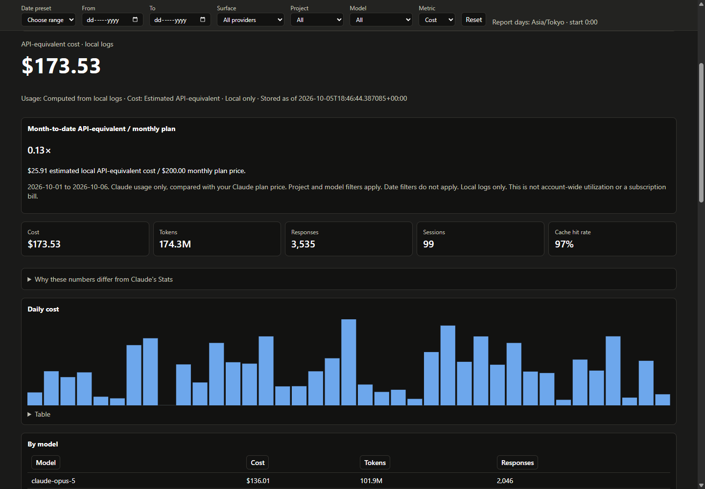
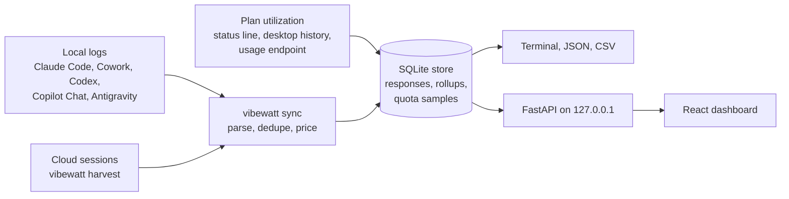

# vibewatt

[](https://pypi.org/project/vibewatt/)
[](https://github.com/MMALI3287/vibewatt/actions/workflows/ci.yml)
[](LICENSE)

**What your AI coding agents really cost, counted once, kept for good and never
uploaded.**

vibewatt reads the logs Claude Code, Cowork, Codex, GitHub Copilot Chat and Google
Antigravity already leave on your machine. It turns them into a terminal report,
JSON for scripts and agents plus a local dashboard. No account, no API key, no
telemetry, no leaderboard.



## Quickstart (30 seconds)

You need [uv](https://docs.astral.sh/uv/) or pipx and Python 3.11 or newer, on
Windows, macOS or Linux.

```bash
uvx vibewatt              # terminal report, nothing installed permanently
uvx vibewatt serve        # dashboard at http://127.0.0.1:8777
uvx vibewatt doctor       # what it can and cannot see on this machine
```

To keep it: `uv tool install vibewatt` (or `pipx install vibewatt`). The first run
reads your logs into a local SQLite store. Later runs only read what changed.

## Why vibewatt

There are bigger tools in this space. vibewatt is narrower on purpose.

- **Correct before broad.** Claude Code logs one line per content block and
  repeats the usage on each. vibewatt keeps one row per response with the largest
  value seen per field, prices 5-minute and 1-hour cache writes separately and
  prices each response at the rate in effect that day. An unknown model shows as
  unpriced, never as $0. Every rule has a test and a written reason in
  [docs/DATA-SOURCES.md](docs/DATA-SOURCES.md).
- **History that outlives the logs.** Claude Code deletes transcripts after 30
  days by default. vibewatt's store keeps every response it has seen, so last
  quarter stays answerable.
- **Plan utilization from official sources only.** Your 5-hour and 7-day
  allowance comes from Claude Code's status line, the desktop app's history or
  the usage endpoint. It is never guessed from token totals. Local-only
  figures are labelled as local-only.
- **Small and local.** A 354 KB wheel with four runtime dependencies. The
  dashboard is prebuilt, so you do not need Node. It listens on 127.0.0.1 only and
  refuses other hosts and cross-site requests.
- **Built for agents too.** `vibewatt status --json` and `quota --json` follow a
  [versioned contract](docs/AGENT-JSON.md) with stable exit codes and never touch
  the network.

### When to use something else

| You want | Try |
|---|---|
| The fastest one-off `npx` report | [ccusage](https://github.com/ccusage/ccusage) |
| A live terminal monitor of the current window | [Claude Code Usage Monitor](https://github.com/Maciek-roboblog/Claude-Code-Usage-Monitor) |
| Coverage of dozens of agents and editors | [codeburn](https://github.com/getagentseal/codeburn) |
| A public leaderboard | [tokscale](https://github.com/junhoyeo/tokscale) |
| A desktop tray widget | [claude-usage-widget](https://github.com/bozdemir/claude-usage-widget) |

Pick vibewatt when you need numbers you can defend: a Claude-heavy workflow,
months of history, Cowork and web sessions in the same view and a dashboard that
never leaves your machine.

## How it works

Local logs and two optional Claude endpoints feed one SQLite store. Every report,
the API and the dashboard read only from that store.



Each provider is one module in `vibewatt/ingest/` with `discover()` and `parse()`.
A new provider is usually that module plus its rates in `vibewatt/pricing.py`.

## Keep your history first

Claude Code deletes session transcripts older than `cleanupPeriodDays`, **30 days**
by default, at every startup. Nothing can recover them afterwards.

```jsonc
// ~/.claude/settings.json   (%USERPROFILE%\.claude\settings.json on Windows)
{ "cleanupPeriodDays": 3650 }
```

Do not set it to `0`: that never means "keep forever"
([claude-code#23710](https://github.com/anthropics/claude-code/issues/23710)).
vibewatt's own store keeps every response from its first sync onward, even after
Claude Code prunes the log. `vibewatt doctor` shows your setting and your coverage.

## What it covers

| Surface | Token-level history | Counted in plan utilization |
|---|---|---|
| Claude Code (local) | yes, from `~/.claude/projects` | yes |
| Cowork (local) | yes, from the desktop data directory | yes |
| Claude Code on the web | session totals, via `vibewatt harvest` | yes |
| Cowork remote sessions | session totals, via `vibewatt harvest` | yes |
| claude.ai chat | no | yes |
| Codex CLI and IDE | yes, from `~/.codex/sessions` | Codex plan windows, kept separate |
| GitHub Copilot Chat (VS Code) | yes, from VS Code's chat-session store | premium requests, kept separate |
| Google Antigravity | yes, from `~/.gemini/antigravity` | no local copy exists |

Web and remote sessions run in cloud containers, so their logs never reach your
disk. The Claude Code session API still reports each session's tokens, cost, title
and model; `vibewatt harvest` stores them.

**Plan utilization** is the one account-wide number: your 5-hour and 7-day
allowance, whichever surface spent it. Codex and Copilot plan readings show in
their own meters and never mix with Claude's. Everything else is labelled with what it
covers. Anything vibewatt cannot see, it says so rather than reporting zero.

## Features

- **Dashboard:** hero figures, plan meters with pace and a projected range at
  reset, daily and hour-of-day charts, a calendar heatmap, sessions with search
  and detail, project and model drill-downs, rate-limit blocks.
- **Analysis:** cost anomalies, cache opportunities, token-waste checks,
  peak windows and context warnings, each with its evidence. Dismissals persist.
- **Wrapped:** a year in review with a shareable image card.
- **Filters** by date, provider, surface, project and model, kept in the URL.
  "All providers" splits every figure by source.
- **Report-date presets**, header session search (`/`) and visible-tab refresh
  every 60 seconds. Usage figures show their provenance and freshness.
- **Plan comparison:** current month-to-date local API-equivalent cost against
  the configured monthly fee, with incomplete pricing flagged.
- **Why the numbers differ:** your figures next to what Claude's own Stats would
  show, with the reasons.
- **Terminal, JSON and CSV** output plus `vibewatt statusline` for Claude Code's
  status bar.
- **Accessible:** keyboard navigation, WCAG AA contrast and both themes are tested.

## Why the numbers are right

- **Each response is counted once.** Claude Code writes one log line per content
  block and repeats the whole response's usage on each. Summing lines inflates
  input and output about 2.8x. vibewatt keeps one row per response with the
  largest value seen for each field. The first line carries a placeholder output
  count, so keeping it would undercount output by up to 24%.
- **Cache writes are priced by TTL.** A 1-hour write costs 2x base input and a
  5-minute write 1.25x; one flat multiplier was 38% off on a real session.
- **Unknown models are never free.** Rates come from Anthropic's published pricing,
  looked up by exact model id. A community table only fills gaps. A model nobody
  can price is shown as unpriced, not as $0.
- **Days are yours.** Day boundaries follow your time zone. `day_start_hour` lets
  a late-night session count as one day. The local timezone keeps historical DST
  rules. Sync also reprices retained local turns when rates or overrides change;
  harvested cloud costs stay unchanged.

[docs/DATA-SOURCES.md](docs/DATA-SOURCES.md) documents every input and outbound
call. [docs/ANALYSIS.md](docs/ANALYSIS.md) explains every finding and alert.

## Commands

```
vibewatt report        terminal report (default)
vibewatt serve         dashboard                       --host --port --no-browser
vibewatt doctor        what vibewatt can and cannot see and why
vibewatt sync          read changed local logs into the store
vibewatt harvest       ingest cloud session usage      --file sessions.json
vibewatt sessions      sessions across every surface, with titles
vibewatt json          full data as JSON               --out
vibewatt csv           per day per model               --out
vibewatt blocks        recent rate-limit windows
vibewatt statusline    Claude Code status line: records plan utilization
vibewatt status        retained local usage and quota snapshot     --json --out
vibewatt quota         retained current quota snapshot              --json --out
vibewatt export        archive the store for another machine          --include-titles
vibewatt import        merge a .vwx archive from another machine
```

`status --json` and `quota --json` never sync logs or fetch network data.
See [the versioned agent contract and exit codes](docs/AGENT-JSON.md).
Open work and its prerequisites are in [docs/DEFERRED.md](docs/DEFERRED.md).

Shared flags: `--source {all,claude,claude-code,cowork,codex,copilot,antigravity}`, `--since YYYY-MM-DD`, `--days N`,
`--tz Asia/Tokyo`, `--day-start-hour H`, `--weeks N`, `--session-hours N`,
`--plan 20`, `--no-sidechains`, `--by-project`, `--mask-projects`, `--no-quota`,
`--offline`, `--no-color`.

### If a number looks wrong

| Symptom | Cause |
|---|---|
| Streak is 0 but you use Claude daily | Web, Cowork remote and claude.ai chat write no local logs. Only plan utilization counts them. |
| Fewer projects than you worked on | Logs older than `cleanupPeriodDays` were deleted before vibewatt stored them. |
| Much lower than Claude's Stats | The Stats count every log line without dedup. Open "Why these numbers differ" on the Overview. |
| Cost looks enormous | It is the API-equivalent, not your bill. Pass `--plan 20` to see what your subscription saves. |

## Plan utilization

vibewatt reads plan utilization from, in order:

1. `vibewatt statusline`, set as Claude Code's status line. Free and live.
2. The Claude desktop app's own usage history, read only.
3. The usage endpoint Claude Code uses, as a fallback at most every 10 minutes.

```json
{ "statusLine": { "type": "command", "command": "vibewatt statusline" } }
```

Put that in `~/.claude/settings.json`. To keep an existing status line, set its
command as `statusline_chain` in vibewatt's config; its output is shown first.

## Configuration

Optional JSON in `%APPDATA%\vibewatt\vibewatt.json` (Windows),
`~/Library/Application Support/vibewatt/vibewatt.json` (macOS),
`${XDG_CONFIG_HOME:-~/.config}/vibewatt/vibewatt.json` (Linux) or
`./.vibewatt/vibewatt.json` per project. `VIBEWATT_CONFIG` points at another file.

```json
{
  "timezone": "Asia/Tokyo",
  "day_start_hour": 6,
  "plan_usd_per_month": 20,
  "mask_projects": false,
  "statusline_chain": "my-existing-statusline",
  "project_aliases": { "-home-user-api": "API" },
  "pricing_overrides": { "claude-opus-5": { "input": 4.0, "output": 20.0 } },
  "ai_summary": { "enabled": false }
}
```

Where it reads from:

| Source | Path | Override |
|---|---|---|
| Claude Code | `~/.claude/projects/**/*.jsonl` | `CLAUDE_CONFIG_DIR` |
| Cowork | `<desktop data dir>/{local-agent-mode-sessions,claude-code-sessions}/**/audit.jsonl` | `VIBEWATT_COWORK_DIR` |
| Codex | `~/.codex/{sessions,archived_sessions}/**/rollout-*.jsonl` | `CODEX_HOME` |
| Copilot Chat | `<VS Code User dir>/{workspaceStorage/*/chatSessions,globalStorage/emptyWindowChatSessions}/*.jsonl` | `VIBEWATT_VSCODE_USER_DIRS` |
| Antigravity | `~/.gemini/antigravity*/conversations/*.db`, read only | `ANTIGRAVITY_DATA_DIR` |
| Store | `%LOCALAPPDATA%\vibewatt`, `~/Library/Application Support/vibewatt`, `~/.local/share/vibewatt` | `VIBEWATT_DATA_DIR` |

The desktop data directory is `%APPDATA%\Claude`, `~/Library/Application Support/Claude`
or `~/.config/Claude`.

## Privacy

Everything is computed locally and kept in one SQLite file. From your logs vibewatt
stores token counts, models, timestamps, project and session ids and **one title
per session**: the name Claude Code shows, or failing that the latest prompt or the
first message, up to 500 characters. No other prompt text, no responses and no file
contents. Paths of files the agent read are kept only as keyed hashes.

The dashboard listens on 127.0.0.1. It refuses requests whose `Host` is not a
loopback name as well as cross-site requests that change state, so another page in
your browser cannot read it or drive it.

Network calls, all optional:

| Call | Sends | When | Off switch |
|---|---|---|---|
| Pricing table (LiteLLM, GitHub) | nothing | at most once a day | `--offline` |
| `api.anthropic.com/api/oauth/usage` | your Claude Code OAuth token | plan utilization fallback, at most every 10 min | `--no-quota` |
| `status.claude.com` | nothing | dashboard status banner, cached 5 min | `--offline` |
| Anthropic Messages API | your `ANTHROPIC_API_KEY` and weekly totals | only when you ask for an AI weekly summary | off by default |

`--mask-projects` replaces project names with `project 1`, `project 2` and so on in
every view and export.

## Caveats

- **Codex and Antigravity costs are API-equivalent estimates; Copilot uses the
  credits GitHub logs.** Each provider's sources and rates are in
  [docs/DATA-SOURCES.md](docs/DATA-SOURCES.md).
- **Cost is an estimate at list API rates.** On a Pro or Max subscription it is what
  the same tokens would have cost pay-as-you-go, not what you were billed.
- The usage endpoint and the cloud session API are undocumented and can change.
  vibewatt falls back to local data when they do.
- Heatmap intensity follows the metric you pick; total tokens are dominated by
  cache reads.

## Roadmap

Shipped in [0.4.0](CHANGELOG.md): Claude Code, Cowork, web and remote sessions,
Codex, Copilot Chat and Antigravity, plan meters, analysis findings, Wrapped and
machine-to-machine export.

Next, in rough order:

- **Contributor issues** labelled
  [good first issue](https://github.com/MMALI3287/vibewatt/labels/good%20first%20issue)
  and [help wanted](https://github.com/MMALI3287/vibewatt/labels/help%20wanted).
- **Gemini CLI**, once someone can share a sanitized session file. The parser is
  not written blind.
- **Copilot CLI** usage, if a later CLI version logs token counts locally.
- **Antigravity plan quotas**, if a local copy ever appears.

Not planned: hosting, accounts, uploads, a tray app or an MCP server. Section 9
of [docs/PLAN.md](docs/PLAN.md) explains why. Open work and its prerequisites
are in [docs/DEFERRED.md](docs/DEFERRED.md).

## Build from source

Only needed to work on vibewatt itself. Use Python 3.11+ and Node 22.12+
(Node 24 is used in CI).

```bash
uv sync
cd web
npm ci
npm run build
cd ..
uv build
pip install dist/vibewatt-*.whl
vibewatt serve
```

The wheel and source archive include the built dashboard. Installed users do not
need Node. Deep links such as `/sessions/<id>` work on reload. For frontend
iteration, run `npm run dev` in `web/` alongside the API.

The old `html` command and `/api/usage` and `/api/dataset` endpoints have been
retired. Use the dashboard, `vibewatt json`/`csv` or the typed `/api/summary` and
`/api/export` endpoints. See [deferred work and prerequisites](docs/DEFERRED.md).

## Upgrading from ccburn

vibewatt was called ccburn. The first run copies an existing ccburn data directory
and store to the vibewatt location and leaves the old one in place. `CCBURN_*`
variables and `ccburn.json` files still work for one release, with a warning.

## Contributing

Issues and pull requests are welcome. Start with [CONTRIBUTING.md](CONTRIBUTING.md)
and the rules in [AGENTS.md](AGENTS.md). Report security problems privately as
described in [SECURITY.md](SECURITY.md). Everyone taking part follows the
[code of conduct](CODE_OF_CONDUCT.md).

## License

[MIT](LICENSE)
