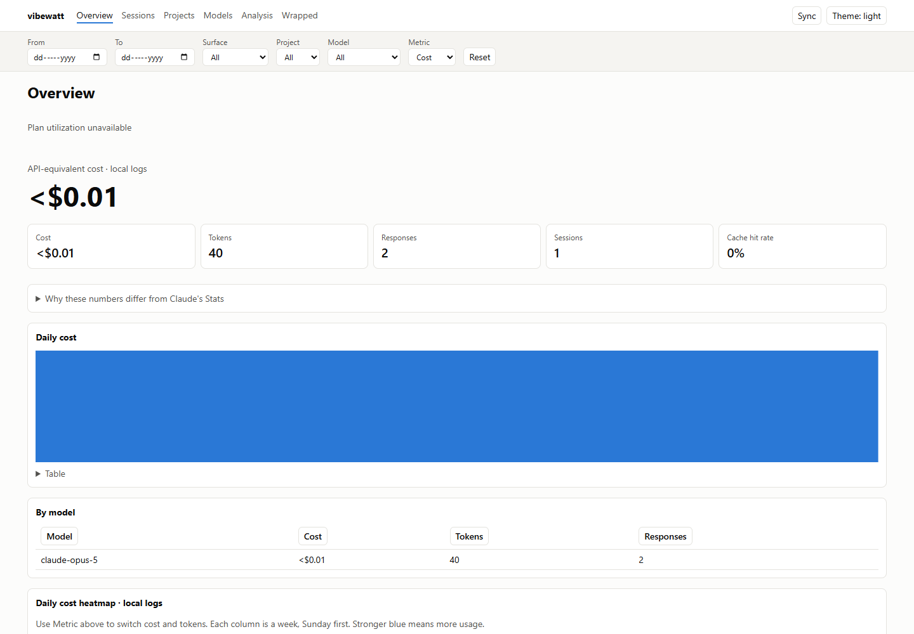

# vibewatt

Token usage, cost and plan utilization for **Claude Code** and **Claude Cowork**,
read from data already on your machine. No account, no API key, no telemetry.

```bash
uv tool install vibewatt      # or: pipx install vibewatt / pip install vibewatt

vibewatt                      # terminal report
vibewatt serve                # dashboard in your browser
vibewatt json | jq .          # machine readable
```

Works on Windows, macOS and Linux with Python 3.11 or newer.

> **Source release:** Phase 7 packages the React dashboard in the wheel.
> Python 3.11 or newer is required; Node is only needed to build from source.
> PyPI currently contains the 0.0.1 name-reservation package. Until the full
> release is published, build and install the wheel as shown below.

> **Renamed from ccburn.** The first run copies an existing ccburn data directory
> and store to the vibewatt location and leaves the old one in place. `CCBURN_*`
> variables and `ccburn.json` files still work for one release, with a warning.

## Dashboard preview

Fixture data, with quota disabled. No personal usage is shown.




## Build and install from source

Use Python 3.11+ and Node 22.12+ (Node 24 is used in CI).

```bash
uv sync
cd web
npm ci
npm run build
cd ..
uv build
pip install dist/vibewatt-0.3.0-py3-none-any.whl
vibewatt serve
```

The wheel and source archive include the built dashboard. Installed users do not
need Node. Deep links such as `/sessions/<id>` work on reload. For frontend
iteration, run `npm run dev` in `web/` alongside the API.

The old `html` command and `/api/usage` and `/api/dataset` endpoints have been
retired. Use the dashboard, `vibewatt json`/`csv` or the typed `/api/summary` and
`/api/export` endpoints. See [deferred work and prerequisites](docs/DEFERRED.md).

## Keep your history first

Claude Code deletes session transcripts older than `cleanupPeriodDays`, **30 days**
by default, at every startup. Nothing can recover them afterwards.

```jsonc
// ~/.claude/settings.json   (%USERPROFILE%\.claude\settings.json on Windows)
{ "cleanupPeriodDays": 3650 }
```

Do not set it to `0`: that never means "keep forever"
([claude-code#23710](https://github.com/anthropics/claude-code/issues/23710)).
vibewatt's own store keeps every response from its first sync onward, even after
Claude Code prunes the log. `vibewatt doctor` shows your setting and your coverage.

## What it covers

| Surface | Token-level history | Counted in plan utilization |
|---|---|---|
| Claude Code (local) | yes, from `~/.claude/projects` | yes |
| Cowork (local) | yes, from the desktop data directory | yes |
| Claude Code on the web | session totals, via `vibewatt harvest` | yes |
| Cowork remote sessions | session totals, via `vibewatt harvest` | yes |
| claude.ai chat | no | yes |

Web and remote sessions run in cloud containers, so their logs never reach your
disk. The Claude Code session API still reports each session's tokens, cost, title
and model; `vibewatt harvest` stores them.

**Plan utilization** is the one account-wide number: your 5-hour and 7-day
allowance, whichever surface spent it. Everything else is labelled with what it
covers. Anything vibewatt cannot see, it says so rather than reporting zero.

## Features

- **Dashboard:** hero figures, plan meters with pace and a projected range at
  reset, daily and hour-of-day charts, a calendar heatmap, sessions with search
  and detail, project and model drill-downs, rate-limit blocks.
- **Analysis:** cost anomalies, cache opportunities, token-waste checks,
  peak windows and context warnings, each with its evidence. Dismissals persist.
- **Wrapped:** a year in review with a shareable image card.
- **Filters** by date, surface, project and model, kept in the URL.
- **Report-date presets**, header session search (`/`) and visible-tab refresh
  every 60 seconds. Usage figures show their provenance and freshness.
- **Plan comparison:** current month-to-date local API-equivalent cost against
  the configured monthly fee, with incomplete pricing flagged.
- **Why the numbers differ:** your figures next to what Claude's own Stats would
  show, with the reasons.
- **Terminal, JSON and CSV** output plus `vibewatt statusline` for Claude Code's
  status bar.
- **Accessible:** keyboard navigation, WCAG AA contrast and both themes are tested.

## Why the numbers are right

- **Each response is counted once.** Claude Code writes one log line per content
  block and repeats the whole response's usage on each. Summing lines inflates
  input and output about 2.8x. vibewatt keeps one row per response with the
  largest value seen for each field: the first line carries a placeholder output
  count; keeping it would undercount output by about 24%.
- **Cache writes are priced by TTL.** A 1-hour write costs 2x base input and a
  5-minute write 1.25x; one flat multiplier was 38% off on a real session.
- **Unknown models are never free.** Rates come from Anthropic's published pricing,
  looked up by exact model id. A community table only fills gaps. A model nobody
  can price is shown as unpriced, not as $0.
- **Days are yours.** Day boundaries follow your time zone. `day_start_hour` lets
  a late-night session count as one day. The local timezone keeps historical DST
  rules. Sync also reprices retained local turns when rates or overrides change;
  harvested cloud costs stay unchanged.

[docs/DATA-SOURCES.md](docs/DATA-SOURCES.md) documents every input and outbound
call. [docs/ANALYSIS.md](docs/ANALYSIS.md) explains every finding and alert.

## Commands

```
vibewatt report        terminal report (default)
vibewatt serve         dashboard                       --host --port --no-browser
vibewatt doctor        what vibewatt can and cannot see, and why
vibewatt sync          read changed local logs into the store
vibewatt harvest       ingest cloud session usage      --file sessions.json
vibewatt sessions      sessions across every surface, with titles
vibewatt json          full data as JSON               --out
vibewatt csv           per day per model               --out
vibewatt blocks        recent rate-limit windows
vibewatt statusline    Claude Code status line: records plan utilization
vibewatt status        retained local usage and quota snapshot     --json --out
vibewatt quota         retained current quota snapshot              --json --out
```

`status --json` and `quota --json` never sync logs or fetch network data.
See [the versioned agent contract and exit codes](docs/AGENT-JSON.md).
See [the Phase 8 build plan](docs/COMPLETION-QUESTIONS.md) for the finite
backlog after the completed phases.

Shared flags: `--source {claude-code,cowork,all}`, `--since YYYY-MM-DD`, `--days N`,
`--tz Asia/Tokyo`, `--day-start-hour H`, `--weeks N`, `--session-hours N`,
`--plan 20`, `--no-sidechains`, `--by-project`, `--mask-projects`, `--no-quota`,
`--offline`, `--no-color`.

### If a number looks wrong

| Symptom | Cause |
|---|---|
| Streak is 0 but you use Claude daily | Web, Cowork remote and claude.ai chat write no local logs. Only plan utilization counts them. |
| Fewer projects than you worked on | Logs older than `cleanupPeriodDays` were deleted before vibewatt stored them. |
| Much lower than Claude's Stats | The Stats count every log line without dedup. Open "Why these numbers differ" on the Overview. |
| Cost looks enormous | It is the API-equivalent, not your bill. Pass `--plan 20` to see what your subscription saves. |

## Plan utilization

vibewatt reads plan utilization from, in order:

1. `vibewatt statusline`, set as Claude Code's status line. Free and live.
2. The Claude desktop app's own usage history, read only.
3. The usage endpoint Claude Code uses, as a fallback at most every 10 minutes.

```json
{ "statusLine": { "type": "command", "command": "vibewatt statusline" } }
```

Put that in `~/.claude/settings.json`. To keep an existing status line, set its
command as `statusline_chain` in vibewatt's config; its output is shown first.

## Configuration

Optional JSON in `%APPDATA%\vibewatt\vibewatt.json` (Windows),
`~/Library/Application Support/vibewatt/vibewatt.json` (macOS),
`${XDG_CONFIG_HOME:-~/.config}/vibewatt/vibewatt.json` (Linux) or
`./.vibewatt/vibewatt.json` per project. `VIBEWATT_CONFIG` points at another file.

```json
{
  "timezone": "Asia/Tokyo",
  "day_start_hour": 6,
  "plan_usd_per_month": 20,
  "mask_projects": false,
  "statusline_chain": "my-existing-statusline",
  "project_aliases": { "-home-user-api": "API" },
  "pricing_overrides": { "claude-opus-5": { "input": 4.0, "output": 20.0 } },
  "ai_summary": { "enabled": false }
}
```

Where it reads from:

| Source | Path | Override |
|---|---|---|
| Claude Code | `~/.claude/projects/**/*.jsonl` | `CLAUDE_CONFIG_DIR` |
| Cowork | `<desktop data dir>/{local-agent-mode-sessions,claude-code-sessions}/**/audit.jsonl` | `VIBEWATT_COWORK_DIR` |
| Store | `%LOCALAPPDATA%\vibewatt`, `~/Library/Application Support/vibewatt`, `~/.local/share/vibewatt` | `VIBEWATT_DATA_DIR` |

The desktop data directory is `%APPDATA%\Claude`, `~/Library/Application Support/Claude`
or `~/.config/Claude`.

## Privacy

Everything is computed locally and kept in one SQLite file. From your logs vibewatt
stores token counts, models, timestamps, project and session ids and **one title
per session**: the name Claude Code shows, or failing that the latest prompt or the
first message, up to 500 characters. No other prompt text, no responses and no file
contents. Paths of files the agent read are kept only as keyed hashes.

The dashboard listens on 127.0.0.1. It refuses requests whose `Host` is not a
loopback name as well as cross-site requests that change state, so another page in
your browser cannot read it or drive it.

Network calls, all optional:

| Call | Sends | When | Off switch |
|---|---|---|---|
| Pricing table (LiteLLM, GitHub) | nothing | at most once a day | `--offline` |
| `api.anthropic.com/api/oauth/usage` | your Claude Code OAuth token | plan utilization fallback, at most every 10 min | `--no-quota` |
| `status.claude.com` | nothing | dashboard status banner, cached 5 min | `--offline` |
| Anthropic Messages API | your `ANTHROPIC_API_KEY` and weekly totals | only when you ask for an AI weekly summary | off by default |

`--mask-projects` replaces project names with `project 1`, `project 2` and so on in
every view and export.

## Caveats

- **Cost is an estimate at list API rates.** On a Pro or Max subscription it is what
  the same tokens would have cost pay-as-you-go, not what you were billed.
- The usage endpoint and the cloud session API are undocumented and can change.
  vibewatt falls back to local data when they do.
- Heatmap intensity follows the metric you pick; total tokens are dominated by
  cache reads.

## Contributing

Issues and pull requests are welcome. See [CONTRIBUTING.md](CONTRIBUTING.md).

## License

[MIT](LICENSE)
